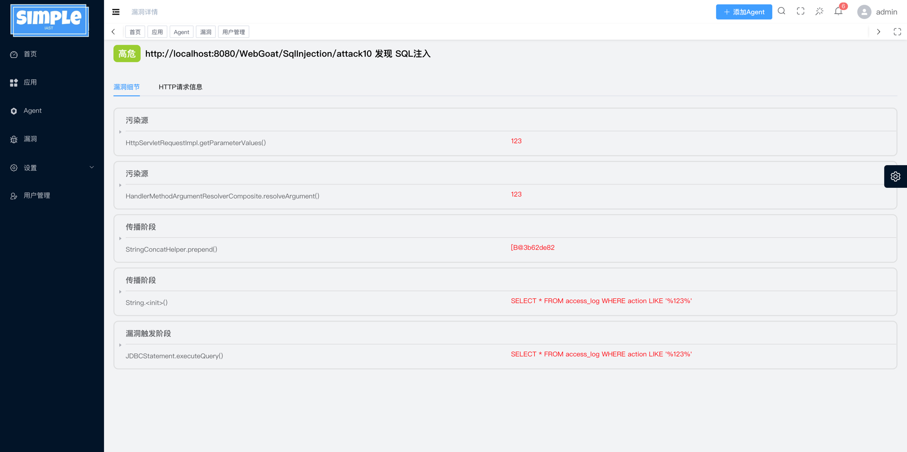

# simpleIAST

[](https://github.com/keven1z/simpleIAST/releases)  [](LICENSE)

#### [简体中文](README.md) / [English](README_EN.md)

基于污点追踪的灰盒漏洞扫描工具，实时识别并展示 Java Web 应用中的常见安全漏洞。

---

## 目录

- [简介](#简介)
- [快速开始](#快速开始)
    - [克隆项目](#克隆项目)
    - [使用 Docker 启动](#使用-docker-启动)
    - [Agent 启动方式](#agent-启动方式)
- [特性与兼容性](#特性与兼容性)
    - [支持中间件](#支持中间件)
    - [支持 JDK 版本](#支持-jdk-版本)
    - [检测漏洞类型](#检测漏洞类型)
- [演示界面](#演示界面)
- [进一步文档](#进一步文档)
- [许可](#许可)

---

## 简介

simpleIAST 是一款基于 Java Agent 的灰盒漏洞扫描工具，利用污点追踪技术在应用运行时检测 Java Web 应用中的安全风险，包括但不限于 SQL 注入、反序列化漏洞、XSS 和 XXE 等常见漏洞。工具轻量易集成，兼容主流中间件与 JDK 版本，适合 DevSecOps 场景使用。

---

## 快速开始

### 克隆项目

```bash
git clone https://github.com/keven1z/simpleIAST.git
cd simpleIAST
```

### 使用 Docker 启动

```bash
cd docker/
docker-compose up -d
```

- **前端访问地址**：`http://[your_ip]:8443/`
- **默认登录**：用户名 `admin`，密码 `123456`
- **前端端口**：8443，**后端端口**：81

### Agent 启动方式

#### 1. 随应用启动注入

```bash
java -javaagent:iast-agent.jar -jar [app.jar]
```

#### 2. 应用启动后以 attach 方式注入

```bash
java -jar iast-engine.jar -m install -p [pid]   # 安装 Agent  
java -jar iast-engine.jar -m uninstall -p [pid] # 卸载 Agent
```

> 请确保 `iast-agent.jar` 与 `iast-engine.jar` 位于同一目录。

---

## 特性与兼容性

### 支持中间件

- Tomcat
- Spring Boot
- Jetty
- Weblogic
- GlassFish
- WildFly
- TongWeb
- Resin
- Undertow

### 支持 JDK 版本

- JDK 1.8
- JDK 11

### 检测漏洞类型（含严重等级）

| 序号 | 漏洞类型                     | 严重程度 |
|------|------------------------------|----------|
| 1    | SQL 注入                     | 高危     |
| 2    | 反序列化漏洞                 | 严重     |
| 3    | SSRF（服务端请求伪造）       | 中危     |
| 4    | URL 跳转漏洞                 | 中危     |
| 5    | XXE（XML 外部实体注入）      | 高危     |
| 6    | 命令注入                     | 严重     |
| 7    | 文件上传漏洞                 | 中危     |
| 8    | XSS（跨站脚本攻击）          | 中危     |
| 9    | Spring EL 表达式注入         | 高危     |
| 10   | 数据库弱口令                 | 中危     |
| 11   | XPATH 注入                   | 高危     |
| 12   | 硬编码漏洞                   | 中危     |
| 13   | Fastjson 反序列化漏洞        | 严重     |

---

## 演示界面

漏洞详情展示示例：



---

## 进一步文档

更多使用指南与文档内容请访问项目 Wiki：

- [快速开始](https://github.com/keven1z/simpleIAST/wiki/%E5%BF%AB%E9%80%9F%E5%BC%80%E5%A7%8B)
- [项目](https://github.com/keven1z/simpleIAST/wiki/项目)
- [应用](https://github.com/keven1z/simpleIAST/wiki/%E5%BA%94%E7%94%A8)
- [漏洞](https://github.com/keven1z/simpleIAST/wiki/%E6%BC%8F%E6%B4%9E)
- [设置](https://github.com/keven1z/simpleIAST/wiki/%E8%AE%BE%E7%BD%AE)

---

## 许可

本项目采用 Apache License 2.0 协议，详见 [LICENSE](LICENSE) 文件。
