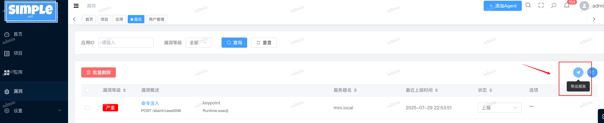

# simpleIAST benchmark说明
## benchmark基准项目
[ant-application-security-testing-benchmark](https://github.com/alipay/ant-application-security-testing-benchmark)
## 开始测试
### ✅ 1. 下载benchmark项目
```shell
git clone https://github.com/alipay/ant-application-security-testing-benchmark.git
cd ant-application-security-testing-benchmark/iast-java
```
### ✅ 2. 增加simpleiast Vendor
#### a. 复制文件/目录
* 将 benchmark/simpleiast 整个文件夹
* 以及 SimpleIASTCaseDataTransfer.java 文件
复制到项目目录：
```text
src/main/java/com/iast/astbenchmark/analyser/factory/stategy/
```
这样 simpleiast 相关代码就能被 factory/stategy 模块直接引用。
#### b. 修改枚举 VendorEnum
文件路径：
```text
src/main/java/com/iast/astbenchmark/analyser/bean/consts/VendorEnum.java
```
在其中增加一个新的枚举常量：
```java
SIMPLEIAST("SIMPLEIAST", "SIMPLEIAST");
```
示例修改后的枚举片段
```java
public enum VendorEnum {
    IAST("IAST", "IAST"),
    SEEKER("SEEKER", "SEEKER"),
    DONGTAI("DONGTAI", "DONGTAI"),
    OPENRASP("OPENRASP", "OPENRASP"),
    XMIRROR("XMIRROR", "XMIRROR"),
    SIMPLEIAST("SIMPLEIAST", "SIMPLEIAST");
    //...省略的代码
}
```
### ✅ 3. 编译jar包并带上simpleiast运行jar包项目
```shell
mvn clean install -DskipTests=true # 在iast-java/target生成iast-java-1.0-SNAPSHOT.jar
java -javaagent:[your-path]/iast-agent.jar -jar iast-java-1.0-SNAPSHOT.jar
```
### ✅ 4. 运行测试
```shell
mvn test -PsimpleIAST 
```
> 运行命令后会出现 `请保存此次跑case的关键字:1755532173081` 的提示，请记下这个关键字。

### ✅ 5. 导出漏洞报告
请登陆simpleIAST服务端->漏洞->导出报告，导出json格式漏洞报告。

### ✅ 6. 分析
在刚刚运行的jar包项目命令下出现`iast-shell`命令输入行
输入如下命令:
```shell
analysis -v SIMPLEIAST -p [your-path]/report-2025-07-29.json  -c 1753800501479 #-c 后为4步骤中生成的case关键字,-p 后为导出json报告路径
```
## 分析结果
2025-07-29 分析结果如下：
```text
------------------------------------------------------------------------------------
检测结果:TOTAL:136 漏报:65 通过:71 
类别概览:
污点对象完整度能力检测
TOTAL:23 漏报:12 通过:11 
污点链路完整度能力检测
TOTAL:68 漏报:24 通过:44 
异步跟踪能力检测
TOTAL:7 漏报:7 通过:0 
跨进程跟踪能力检测
TOTAL:0 通过:0 
污点准确度能力检测
TOTAL:34 漏报:18 通过:16 
```
详情
```
测试详情:
污点对象完整度能力检测-----------------------------------------------------------------
aTaintCase00901->IAST引擎能力评估体系(JAVA)->IAST引擎能力评估体系(JAVA)->完整度->基础跟踪能力->污点对象完整度->字符串对象->String:通过
aTaintCase001->IAST引擎能力评估体系(JAVA)->IAST引擎能力评估体系(JAVA)->完整度->基础跟踪能力->污点对象完整度->基本数据类型及其封装类型->int:漏报
aTaintCase002->IAST引擎能力评估体系(JAVA)->IAST引擎能力评估体系(JAVA)->完整度->基础跟踪能力->污点对象完整度->基本数据类型及其封装类型->char:漏报
aTaintCase003->IAST引擎能力评估体系(JAVA)->IAST引擎能力评估体系(JAVA)->完整度->基础跟踪能力->污点对象完整度->基本数据类型及其封装类型->byte:漏报
aTaintCase004->IAST引擎能力评估体系(JAVA)->IAST引擎能力评估体系(JAVA)->完整度->基础跟踪能力->污点对象完整度->基本数据类型及其封装类型->long:漏报
aTaintCase005->IAST引擎能力评估体系(JAVA)->IAST引擎能力评估体系(JAVA)->完整度->基础跟踪能力->污点对象完整度->集合(集合对象全为污点)->Map元素:漏报 通过
aTaintCase006->IAST引擎能力评估体系(JAVA)->IAST引擎能力评估体系(JAVA)->完整度->基础跟踪能力->污点对象完整度->集合(集合对象全为污点)->List元素:漏报 通过
aTaintCase007->IAST引擎能力评估体系(JAVA)->IAST引擎能力评估体系(JAVA)->完整度->基础跟踪能力->污点对象完整度->集合(集合对象全为污点)->Queue元素:漏报  自定义对象 通过
aTaintCase008->IAST引擎能力评估体系(JAVA)->IAST引擎能力评估体系(JAVA)->完整度->基础跟踪能力->污点对象完整度->集合(集合对象全为污点)->Set元素:漏报 自定义对象 通过
aTaintCase009->IAST引擎能力评估体系(JAVA)->IAST引擎能力评估体系(JAVA)->完整度->基础跟踪能力->污点对象完整度->基本数据类型及其封装类型->Byte:漏报 暂不处理
aTaintCase0010->IAST引擎能力评估体系(JAVA)->IAST引擎能力评估体系(JAVA)->完整度->基础跟踪能力->污点对象完整度->基本数据类型及其封装类型->Integer:漏报 暂不处理
aTaintCase0011->IAST引擎能力评估体系(JAVA)->IAST引擎能力评估体系(JAVA)->完整度->基础跟踪能力->污点对象完整度->基本数据类型及其封装类型->Long:漏报 暂不处理
aTaintCase0012->IAST引擎能力评估体系(JAVA)->IAST引擎能力评估体系(JAVA)->完整度->基础跟踪能力->污点对象完整度->基本数据类型及其封装类型->Character:漏报 暂不处理
aTaintCase0013->IAST引擎能力评估体系(JAVA)->IAST引擎能力评估体系(JAVA)->完整度->基础跟踪能力->污点对象完整度->数组(数组对象全为污点)->数组对象String[]:漏报 
aTaintCase0014->IAST引擎能力评估体系(JAVA)->IAST引擎能力评估体系(JAVA)->完整度->基础跟踪能力->污点对象完整度->数组(数组对象全为污点)->数组对象char[]:通过
aTaintCase0015->IAST引擎能力评估体系(JAVA)->IAST引擎能力评估体系(JAVA)->完整度->基础跟踪能力->污点对象完整度->数组(数组对象全为污点)->数组对象byte[]:漏报
aTaintCase0016->IAST引擎能力评估体系(JAVA)->IAST引擎能力评估体系(JAVA)->完整度->基础跟踪能力->污点对象完整度->数组(数组对象全为污点)->单维数组对象的元素:漏报
aTaintCase00926->IAST引擎能力评估体系(JAVA)->IAST引擎能力评估体系(JAVA)->完整度->基础跟踪能力->污点对象完整度->数组(数组对象全为污点)->多维数组对象的元素:漏报
aTaintCase00921->IAST引擎能力评估体系(JAVA)->IAST引擎能力评估体系(JAVA)->完整度->基础跟踪能力->污点对象完整度->自定义对象->对象字段->单层字段->10:漏报 通过
aTaintCase00922->IAST引擎能力评估体系(JAVA)->IAST引擎能力评估体系(JAVA)->完整度->基础跟踪能力->污点对象完整度->自定义对象->对象字段->单层字段->100:漏报 通过
aTaintCase00923->IAST引擎能力评估体系(JAVA)->IAST引擎能力评估体系(JAVA)->完整度->基础跟踪能力->污点对象完整度->自定义对象->对象字段->多层字段->3层:漏报 通过
aTaintCase00924->IAST引擎能力评估体系(JAVA)->IAST引擎能力评估体系(JAVA)->完整度->基础跟踪能力->污点对象完整度->自定义对象->对象字段->多层字段->10层:漏报 通过
aTaintCase00925->IAST引擎能力评估体系(JAVA)->IAST引擎能力评估体系(JAVA)->完整度->基础跟踪能力->污点对象完整度->自定义对象->对象字段->污点为父类字段:漏报 通过
污点链路完整度能力检测-----------------------------------------------------------------
aTaintCase0078->IAST引擎能力评估体系(JAVA)->IAST引擎能力评估体系(JAVA)->完整度->基础跟踪能力->污点链路完整度->污点传播跟踪能力->传播场景->String操作->toString:通过
aTaintCase0079->IAST引擎能力评估体系(JAVA)->IAST引擎能力评估体系(JAVA)->完整度->基础跟踪能力->污点链路完整度->污点传播跟踪能力->传播场景->String操作->toUpperCase:通过
aTaintCase0080->IAST引擎能力评估体系(JAVA)->IAST引擎能力评估体系(JAVA)->完整度->基础跟踪能力->污点链路完整度->污点传播跟踪能力->传播场景->String操作->trim:通过
aTaintCase0081->IAST引擎能力评估体系(JAVA)->IAST引擎能力评估体系(JAVA)->完整度->基础跟踪能力->污点链路完整度->污点传播跟踪能力->传播场景->String操作->valueOf:通过
aTaintCase0082->IAST引擎能力评估体系(JAVA)->IAST引擎能力评估体系(JAVA)->完整度->基础跟踪能力->污点链路完整度->污点传播跟踪能力->传播场景->StringBuilder操作->构造方法:通过
aTaintCase0083->IAST引擎能力评估体系(JAVA)->IAST引擎能力评估体系(JAVA)->完整度->基础跟踪能力->污点链路完整度->污点传播跟踪能力->传播场景->StringBuilder操作->append:通过
aTaintCase0085->IAST引擎能力评估体系(JAVA)->IAST引擎能力评估体系(JAVA)->完整度->基础跟踪能力->污点链路完整度->污点传播跟踪能力->传播场景->StringBuilder操作->delete:通过
aTaintCase0086->IAST引擎能力评估体系(JAVA)->IAST引擎能力评估体系(JAVA)->完整度->基础跟踪能力->污点链路完整度->污点传播跟踪能力->传播场景->StringBuilder操作->deleteCharAt:通过
aTaintCase0087->IAST引擎能力评估体系(JAVA)->IAST引擎能力评估体系(JAVA)->完整度->基础跟踪能力->污点链路完整度->污点传播跟踪能力->传播场景->StringBuilder操作->getChars:通过
aTaintCase0088->IAST引擎能力评估体系(JAVA)->IAST引擎能力评估体系(JAVA)->完整度->基础跟踪能力->污点链路完整度->污点传播跟踪能力->传播场景->StringBuilder操作->insert:漏报
aTaintCase0089->IAST引擎能力评估体系(JAVA)->IAST引擎能力评估体系(JAVA)->完整度->基础跟踪能力->污点链路完整度->污点传播跟踪能力->传播场景->StringBuilder操作->replace:通过
aTaintCase0090->IAST引擎能力评估体系(JAVA)->IAST引擎能力评估体系(JAVA)->完整度->基础跟踪能力->污点链路完整度->污点传播跟踪能力->传播场景->StringBuilder操作->subSequence:通过
aTaintCase0091->IAST引擎能力评估体系(JAVA)->IAST引擎能力评估体系(JAVA)->完整度->基础跟踪能力->污点链路完整度->污点传播跟踪能力->传播场景->StringBuilder操作->subString:通过
aTaintCase0092->IAST引擎能力评估体系(JAVA)->IAST引擎能力评估体系(JAVA)->完整度->基础跟踪能力->污点链路完整度->污点传播跟踪能力->传播场景->StringBuilder操作->toString:通过
aTaintCase0093->IAST引擎能力评估体系(JAVA)->IAST引擎能力评估体系(JAVA)->完整度->基础跟踪能力->污点链路完整度->污点传播跟踪能力->传播场景->char[],byte[]操作->copyOf:漏报
aTaintCase0094->IAST引擎能力评估体系(JAVA)->IAST引擎能力评估体系(JAVA)->完整度->基础跟踪能力->污点链路完整度->污点传播跟踪能力->传播场景->char[],byte[]操作->copyOfRange:漏报
aTaintCase0095->IAST引擎能力评估体系(JAVA)->IAST引擎能力评估体系(JAVA)->完整度->基础跟踪能力->污点链路完整度->污点传播跟踪能力->传播场景->char[],byte[]操作->deepToString:漏报
aTaintCase0096->IAST引擎能力评估体系(JAVA)->IAST引擎能力评估体系(JAVA)->完整度->基础跟踪能力->污点链路完整度->污点传播跟踪能力->传播场景->char[],byte[]操作->toString:通过
aTaintCase00932->IAST引擎能力评估体系(JAVA)->IAST引擎能力评估体系(JAVA)->完整度->基础跟踪能力->污点链路完整度->污点传播跟踪能力->传播场景->JDK序列化与反序列化:漏报
aTaintCase00141->IAST引擎能力评估体系(JAVA)->IAST引擎能力评估体系(JAVA)->完整度->基础跟踪能力->污点链路完整度->污点无害化处理能力(sanitizer)->污点直接赋值为硬编码值:漏报
aTaintCase00103->IAST引擎能力评估体系(JAVA)->IAST引擎能力评估体系(JAVA)->完整度->基础跟踪能力->污点链路完整度->污点无害化处理能力(sanitizer)->sanitizer支持区分类型:漏报
aTaintCase00104->IAST引擎能力评估体系(JAVA)->IAST引擎能力评估体系(JAVA)->完整度->基础跟踪能力->污点链路完整度->污点无害化处理能力(sanitizer)->触发sink后再执行sanitizer:漏报
aTaintCase00105->IAST引擎能力评估体系(JAVA)->IAST引擎能力评估体系(JAVA)->完整度->基础跟踪能力->污点链路完整度->污点无害化处理能力(sanitizer)->支持自定义unSanitizer(再次污点化):漏报
aTaintCase00109->IAST引擎能力评估体系(JAVA)->IAST引擎能力评估体系(JAVA)->完整度->基础跟踪能力->污点链路完整度->触发污点跟踪能力（sink）->单污点来源传播至多sink点:通过
aTaintCase00110->IAST引擎能力评估体系(JAVA)->IAST引擎能力评估体系(JAVA)->完整度->基础跟踪能力->污点链路完整度->触发污点跟踪能力（sink）->多污点来源传播至单sink点:通过
aTaintCase00112->IAST引擎能力评估体系(JAVA)->IAST引擎能力评估体系(JAVA)->完整度->基础跟踪能力->污点链路完整度->触发污点跟踪能力（sink）->无污点传播过程，污点直接传入sink:通过
aTaintCase0022->IAST引擎能力评估体系(JAVA)->IAST引擎能力评估体系(JAVA)->完整度->基础跟踪能力->污点链路完整度->特殊链路跟踪能力->三方包方法跟踪:通过
aTaintCase0023->IAST引擎能力评估体系(JAVA)->IAST引擎能力评估体系(JAVA)->完整度->基础跟踪能力->污点链路完整度->特殊链路跟踪能力->超长链路追踪->100层:通过
aTaintCase00931->IAST引擎能力评估体系(JAVA)->IAST引擎能力评估体系(JAVA)->完整度->基础跟踪能力->污点链路完整度->特殊链路跟踪能力->超长链路追踪->1000层:通过
aTaintCase0024->IAST引擎能力评估体系(JAVA)->IAST引擎能力评估体系(JAVA)->完整度->基础跟踪能力->污点链路完整度->特殊链路跟踪能力->反射调用方法跟踪:通过
aTaintCase0025->IAST引擎能力评估体系(JAVA)->IAST引擎能力评估体系(JAVA)->完整度->基础跟踪能力->污点链路完整度->特殊链路跟踪能力->调用native方法:漏报
aTaintCase0027->IAST引擎能力评估体系(JAVA)->IAST引擎能力评估体系(JAVA)->完整度->基础跟踪能力->污点链路完整度->污点来源识别能力(source)->污点来自http getQueryString:通过
aTaintCase0033->IAST引擎能力评估体系(JAVA)->IAST引擎能力评估体系(JAVA)->完整度->基础跟踪能力->污点链路完整度->污点来源识别能力(source)->污点来自http body->json/RequestBody:漏报
aTaintCase0034->IAST引擎能力评估体系(JAVA)->IAST引擎能力评估体系(JAVA)->完整度->基础跟踪能力->污点链路完整度->污点来源识别能力(source)->污点来自http body->xml/getInputStream:漏报
aTaintCase0035->IAST引擎能力评估体系(JAVA)->IAST引擎能力评估体系(JAVA)->完整度->基础跟踪能力->污点链路完整度->污点来源识别能力(source)->污点来自http body->multipart/form-data->getPart:漏报
aTaintCase0036->IAST引擎能力评估体系(JAVA)->IAST引擎能力评估体系(JAVA)->完整度->基础跟踪能力->污点链路完整度->污点来源识别能力(source)->污点来自http body->multipart/form-data->getParts:漏报
aTaintCase0037->IAST引擎能力评估体系(JAVA)->IAST引擎能力评估体系(JAVA)->完整度->基础跟踪能力->污点链路完整度->污点来源识别能力(source)->污点来自http body->form/url-encode->getParameter:通过
aTaintCase0038->IAST引擎能力评估体系(JAVA)->IAST引擎能力评估体系(JAVA)->完整度->基础跟踪能力->污点链路完整度->污点来源识别能力(source)->污点来自http body->form/url-encode->getParameterMap:通过
aTaintCase0039->IAST引擎能力评估体系(JAVA)->IAST引擎能力评估体系(JAVA)->完整度->基础跟踪能力->污点链路完整度->污点来源识别能力(source)->污点来自http body->form/url-encode->getParameterValues:漏报
aTaintCase0040->IAST引擎能力评估体系(JAVA)->IAST引擎能力评估体系(JAVA)->完整度->基础跟踪能力->污点链路完整度->污点来源识别能力(source)->污点来自http body->form/url-encode->getParameterNames:漏报
aTaintCase0041->IAST引擎能力评估体系(JAVA)->IAST引擎能力评估体系(JAVA)->完整度->基础跟踪能力->污点链路完整度->污点来源识别能力(source)->污点来自http body->getReader:漏报
aTaintCase0044->IAST引擎能力评估体系(JAVA)->IAST引擎能力评估体系(JAVA)->完整度->基础跟踪能力->污点链路完整度->污点来源识别能力(source)->污点来自http pathVarlables:通过
aTaintCase0045->IAST引擎能力评估体系(JAVA)->IAST引擎能力评估体系(JAVA)->完整度->基础跟踪能力->污点链路完整度->污点来源识别能力(source)->污点来自http header->getCookies:漏报
aTaintCase0046->IAST引擎能力评估体系(JAVA)->IAST引擎能力评估体系(JAVA)->完整度->基础跟踪能力->污点链路完整度->污点来源识别能力(source)->污点来自http header->getHeader:漏报
aTaintCase0047->IAST引擎能力评估体系(JAVA)->IAST引擎能力评估体系(JAVA)->完整度->基础跟踪能力->污点链路完整度->污点来源识别能力(source)->污点来自http header->getHeaders:漏报
aTaintCase00139->IAST引擎能力评估体系(JAVA)->IAST引擎能力评估体系(JAVA)->完整度->基础跟踪能力->污点链路完整度->污点来源识别能力(source)->污点来自http header->getHeaderNames:漏报
aTaintCase0062->IAST引擎能力评估体系(JAVA)->IAST引擎能力评估体系(JAVA)->完整度->基础跟踪能力->污点链路完整度->污点传播跟踪能力->传播场景->String操作->构造方法->String(String original):通过
aTaintCase00143->IAST引擎能力评估体系(JAVA)->IAST引擎能力评估体系(JAVA)->完整度->基础跟踪能力->污点链路完整度->污点传播跟踪能力->传播场景->String操作->构造方法->String(char value[]):通过
aTaintCase00144->IAST引擎能力评估体系(JAVA)->IAST引擎能力评估体系(JAVA)->完整度->基础跟踪能力->污点链路完整度->污点传播跟踪能力->传播场景->String操作->构造方法->String(char value[], int offset, int count):通过
aTaintCase00145->IAST引擎能力评估体系(JAVA)->IAST引擎能力评估体系(JAVA)->完整度->基础跟踪能力->污点链路完整度->污点传播跟踪能力->传播场景->String操作->构造方法->String(int[] codePoints, int offset, int count):漏报
aTaintCase00146->IAST引擎能力评估体系(JAVA)->IAST引擎能力评估体系(JAVA)->完整度->基础跟踪能力->污点链路完整度->污点传播跟踪能力->传播场景->String操作->构造方法->String(byte bytes[], int offset, int length, String charsetName):通过
aTaintCase00147->IAST引擎能力评估体系(JAVA)->IAST引擎能力评估体系(JAVA)->完整度->基础跟踪能力->污点链路完整度->污点传播跟踪能力->传播场景->String操作->构造方法->String(byte bytes[], int offset, int length, Charset charset):漏报
aTaintCase00148->IAST引擎能力评估体系(JAVA)->IAST引擎能力评估体系(JAVA)->完整度->基础跟踪能力->污点链路完整度->污点传播跟踪能力->传播场景->String操作->构造方法->String(StringBuffer buffer):通过
aTaintCase00149->IAST引擎能力评估体系(JAVA)->IAST引擎能力评估体系(JAVA)->完整度->基础跟踪能力->污点链路完整度->污点传播跟踪能力->传播场景->String操作->构造方法->String(StringBuilder builder):通过
aTaintCase0063->IAST引擎能力评估体系(JAVA)->IAST引擎能力评估体系(JAVA)->完整度->基础跟踪能力->污点链路完整度->污点传播跟踪能力->传播场景->String操作->conact:通过
aTaintCase0064->IAST引擎能力评估体系(JAVA)->IAST引擎能力评估体系(JAVA)->完整度->基础跟踪能力->污点链路完整度->污点传播跟踪能力->传播场景->String操作->copyValueOf:通过
aTaintCase0065->IAST引擎能力评估体系(JAVA)->IAST引擎能力评估体系(JAVA)->完整度->基础跟踪能力->污点链路完整度->污点传播跟踪能力->传播场景->String操作->format:通过
aTaintCase0066->IAST引擎能力评估体系(JAVA)->IAST引擎能力评估体系(JAVA)->完整度->基础跟踪能力->污点链路完整度->污点传播跟踪能力->传播场景->String操作->getBytes:通过
aTaintCase0067->IAST引擎能力评估体系(JAVA)->IAST引擎能力评估体系(JAVA)->完整度->基础跟踪能力->污点链路完整度->污点传播跟踪能力->传播场景->String操作->getChars:通过
aTaintCase0068->IAST引擎能力评估体系(JAVA)->IAST引擎能力评估体系(JAVA)->完整度->基础跟踪能力->污点链路完整度->污点传播跟踪能力->传播场景->String操作->intern:通过
aTaintCase0069->IAST引擎能力评估体系(JAVA)->IAST引擎能力评估体系(JAVA)->完整度->基础跟踪能力->污点链路完整度->污点传播跟踪能力->传播场景->String操作->join:通过
aTaintCase0071->IAST引擎能力评估体系(JAVA)->IAST引擎能力评估体系(JAVA)->完整度->基础跟踪能力->污点链路完整度->污点传播跟踪能力->传播场景->String操作->replace:通过
aTaintCase00140->IAST引擎能力评估体系(JAVA)->IAST引擎能力评估体系(JAVA)->完整度->基础跟踪能力->污点链路完整度->污点传播跟踪能力->传播场景->String操作->replaceAll:漏报
aTaintCase0072->IAST引擎能力评估体系(JAVA)->IAST引擎能力评估体系(JAVA)->完整度->基础跟踪能力->污点链路完整度->污点传播跟踪能力->传播场景->String操作->split:通过
aTaintCase0074->IAST引擎能力评估体系(JAVA)->IAST引擎能力评估体系(JAVA)->完整度->基础跟踪能力->污点链路完整度->污点传播跟踪能力->传播场景->String操作->subSequence:通过
aTaintCase0075->IAST引擎能力评估体系(JAVA)->IAST引擎能力评估体系(JAVA)->完整度->基础跟踪能力->污点链路完整度->污点传播跟踪能力->传播场景->String操作->substring:通过
aTaintCase0076->IAST引擎能力评估体系(JAVA)->IAST引擎能力评估体系(JAVA)->完整度->基础跟踪能力->污点链路完整度->污点传播跟踪能力->传播场景->String操作->toCharArray:通过
aTaintCase0077->IAST引擎能力评估体系(JAVA)->IAST引擎能力评估体系(JAVA)->完整度->基础跟踪能力->污点链路完整度->污点传播跟踪能力->传播场景->String操作->toLowerCase:通过
异步跟踪能力检测-----------------------------------------------------------------
aTaintCase00113->IAST引擎能力评估体系(JAVA)->IAST引擎能力评估体系(JAVA)->完整度->异步跟踪能力->存储型异步->污点通过db存储后触发:漏报
aTaintCase00114->IAST引擎能力评估体系(JAVA)->IAST引擎能力评估体系(JAVA)->完整度->异步跟踪能力->存储型异步->污点通过session存储后触发:漏报
aTaintCase00115->IAST引擎能力评估体系(JAVA)->IAST引擎能力评估体系(JAVA)->完整度->异步跟踪能力->存储型异步->污点通过缓存存储后触发->本地缓存:漏报
aTaintCase00138->IAST引擎能力评估体系(JAVA)->IAST引擎能力评估体系(JAVA)->完整度->异步跟踪能力->存储型异步->污点通过缓存存储后触发->非本地缓存:漏报
aTaintCase00116->IAST引擎能力评估体系(JAVA)->IAST引擎能力评估体系(JAVA)->完整度->异步跟踪能力->存储型异步->污点通过文件存储后触发->本地文件:漏报
aTaintCase00119->IAST引擎能力评估体系(JAVA)->IAST引擎能力评估体系(JAVA)->完整度->异步跟踪能力->多线程异步->污点的来源和触发在不同线程:漏报
aTaintCase00120->IAST引擎能力评估体系(JAVA)->IAST引擎能力评估体系(JAVA)->完整度->异步跟踪能力->多线程异步->污点的来源和触发在不同线程，sink的触发由线程池中的线程触发:漏报
跨进程跟踪能力检测-----------------------------------------------------------------
污点准确度能力检测-----------------------------------------------------------------
aTaintCase00125->IAST引擎能力评估体系(JAVA)->IAST引擎能力评估体系(JAVA)->准确度->污点对象跟踪粒度->变量级别->sink点的值非外部可控，但与某个参数值相同:通过
aTaintCase00126->IAST引擎能力评估体系(JAVA)->IAST引擎能力评估体系(JAVA)->准确度->污点对象跟踪粒度->字段/元素级别->部分字段对象为污点->单层简单对象部分字段为污点:漏报
aTaintCase00127->IAST引擎能力评估体系(JAVA)->IAST引擎能力评估体系(JAVA)->准确度->污点对象跟踪粒度->字段/元素级别->部分字段对象为污点->多层复杂对象部分字段为污点->污点来自父类:漏报
aTaintCase00128->IAST引擎能力评估体系(JAVA)->IAST引擎能力评估体系(JAVA)->准确度->污点对象跟踪粒度->字段/元素级别->部分字段对象为污点->多层复杂对象部分字段为污点->污点来当前类字段:漏报
aTaintCase00129->IAST引擎能力评估体系(JAVA)->IAST引擎能力评估体系(JAVA)->准确度->污点对象跟踪粒度->字段/元素级别->部分数据元素为污点->单维数组中的部分元素为污点:通过
aTaintCase00130->IAST引擎能力评估体系(JAVA)->IAST引擎能力评估体系(JAVA)->准确度->污点对象跟踪粒度->字段/元素级别->部分数据元素为污点->多维数组中的部分元素为污点:漏报
aTaintCase00131->IAST引擎能力评估体系(JAVA)->IAST引擎能力评估体系(JAVA)->准确度->污点对象跟踪粒度->字段/元素级别->部分数据元素为污点->部分元素为污点，经过JDK序列化后再反序列化:漏报
aTaintCase00132->IAST引擎能力评估体系(JAVA)->IAST引擎能力评估体系(JAVA)->准确度->污点对象跟踪粒度->字段/元素级别->部分集合元素为污点->List中部分元素为污点:漏报
aTaintCase00133->IAST引擎能力评估体系(JAVA)->IAST引擎能力评估体系(JAVA)->准确度->污点对象跟踪粒度->字段/元素级别->部分集合元素为污点->Map中部分元素为污点:漏报
aTaintCase00134->IAST引擎能力评估体系(JAVA)->IAST引擎能力评估体系(JAVA)->准确度->污点对象跟踪粒度->字段/元素级别->部分集合元素为污点->Set中部分元素为污点:漏报
aTaintCase00135->IAST引擎能力评估体系(JAVA)->IAST引擎能力评估体系(JAVA)->准确度->污点对象跟踪粒度->字段/元素级别->部分集合元素为污点->Queue中部分元素为污点:漏报
aTaintCase00136->IAST引擎能力评估体系(JAVA)->IAST引擎能力评估体系(JAVA)->准确度->污点对象跟踪粒度->字段/元素级别->部分集合元素为污点->集合中部分元素为污点，经过JDK序列化后再反序列化:漏报
aTaintCase00940->IAST引擎能力评估体系(JAVA)->IAST引擎能力评估体系(JAVA)->准确度->污点对象跟踪粒度->字符串级别->字符串部分存在污点->截取非污点部分->String操作->replcace:漏报
aTaintCase00941->IAST引擎能力评估体系(JAVA)->IAST引擎能力评估体系(JAVA)->准确度->污点对象跟踪粒度->字符串级别->字符串部分存在污点->截取非污点部分->String操作->replcaceAll:漏报
aTaintCase00942->IAST引擎能力评估体系(JAVA)->IAST引擎能力评估体系(JAVA)->准确度->污点对象跟踪粒度->字符串级别->字符串部分存在污点->截取非污点部分->String操作->split:通过
aTaintCase00943->IAST引擎能力评估体系(JAVA)->IAST引擎能力评估体系(JAVA)->准确度->污点对象跟踪粒度->字符串级别->字符串部分存在污点->截取非污点部分->String操作->subSequence:通过
aTaintCase00944->IAST引擎能力评估体系(JAVA)->IAST引擎能力评估体系(JAVA)->准确度->污点对象跟踪粒度->字符串级别->字符串部分存在污点->截取非污点部分->String操作->substring:通过
aTaintCase00945->IAST引擎能力评估体系(JAVA)->IAST引擎能力评估体系(JAVA)->准确度->污点对象跟踪粒度->字符串级别->字符串部分存在污点->截取非污点部分->String操作->trim:通过
aTaintCase00946->IAST引擎能力评估体系(JAVA)->IAST引擎能力评估体系(JAVA)->准确度->污点对象跟踪粒度->字符串级别->字符串部分存在污点->截取非污点部分->StringBuilder操作->delete:通过
aTaintCase00947->IAST引擎能力评估体系(JAVA)->IAST引擎能力评估体系(JAVA)->准确度->污点对象跟踪粒度->字符串级别->字符串部分存在污点->截取非污点部分->StringBuilder操作->deleteCharAt:漏报
aTaintCase00948->IAST引擎能力评估体系(JAVA)->IAST引擎能力评估体系(JAVA)->准确度->污点对象跟踪粒度->字符串级别->字符串部分存在污点->截取非污点部分->StringBuilder操作->getChars:漏报
aTaintCase00949->IAST引擎能力评估体系(JAVA)->IAST引擎能力评估体系(JAVA)->准确度->污点对象跟踪粒度->字符串级别->字符串部分存在污点->截取非污点部分->StringBuilder操作->replace:漏报
aTaintCase00950->IAST引擎能力评估体系(JAVA)->IAST引擎能力评估体系(JAVA)->准确度->污点对象跟踪粒度->字符串级别->字符串部分存在污点->截取非污点部分->StringBuilder操作->subSequence:通过
aTaintCase00951->IAST引擎能力评估体系(JAVA)->IAST引擎能力评估体系(JAVA)->准确度->污点对象跟踪粒度->字符串级别->字符串部分存在污点->截取非污点部分->StringBuilder操作->substring:漏报
aTaintCase00952->IAST引擎能力评估体系(JAVA)->IAST引擎能力评估体系(JAVA)->准确度->污点对象跟踪粒度->字符串级别->字符串部分存在污点->截取非污点部分->char[]/byte[]操作->copyOfRange:通过
aTaintCase00953->IAST引擎能力评估体系(JAVA)->IAST引擎能力评估体系(JAVA)->准确度->污点对象跟踪粒度->字符串级别->字符串部分存在污点->截取非污点部分后再拼接污点->String操作->concat:通过
aTaintCase00954->IAST引擎能力评估体系(JAVA)->IAST引擎能力评估体系(JAVA)->准确度->污点对象跟踪粒度->字符串级别->字符串部分存在污点->截取非污点部分后再拼接污点->String操作->join:通过
aTaintCase00955->IAST引擎能力评估体系(JAVA)->IAST引擎能力评估体系(JAVA)->准确度->污点对象跟踪粒度->字符串级别->字符串部分存在污点->截取非污点部分后再拼接污点->String操作->replace:通过
aTaintCase00956->IAST引擎能力评估体系(JAVA)->IAST引擎能力评估体系(JAVA)->准确度->污点对象跟踪粒度->字符串级别->字符串部分存在污点->截取非污点部分后再拼接污点->String操作->replaceAll:通过
aTaintCase00957->IAST引擎能力评估体系(JAVA)->IAST引擎能力评估体系(JAVA)->准确度->污点对象跟踪粒度->字符串级别->字符串部分存在污点->截取非污点部分后再拼接污点->String操作->trim:通过
aTaintCase00958->IAST引擎能力评估体系(JAVA)->IAST引擎能力评估体系(JAVA)->准确度->污点对象跟踪粒度->字符串级别->字符串部分存在污点->截取非污点部分后再拼接污点->StringBuilder操作->append:通过
aTaintCase00959->IAST引擎能力评估体系(JAVA)->IAST引擎能力评估体系(JAVA)->准确度->污点对象跟踪粒度->字符串级别->字符串部分存在污点->截取非污点部分后再拼接污点->StringBuilder操作->replace:通过
aTaintCase00960->IAST引擎能力评估体系(JAVA)->IAST引擎能力评估体系(JAVA)->准确度->污点对象跟踪粒度->字符串级别->字符串部分存在污点->截取非污点部分后再拼接污点->char[]/byte[]操作->copyOfRange:漏报
aTaintCase00142->IAST引擎能力评估体系(JAVA)->IAST引擎能力评估体系(JAVA)->准确度->污点对象跟踪粒度->字段/元素级别->部分字段对象为污点->对象部分字段为污点，经过JDK序列化后再反序列化:漏报
```